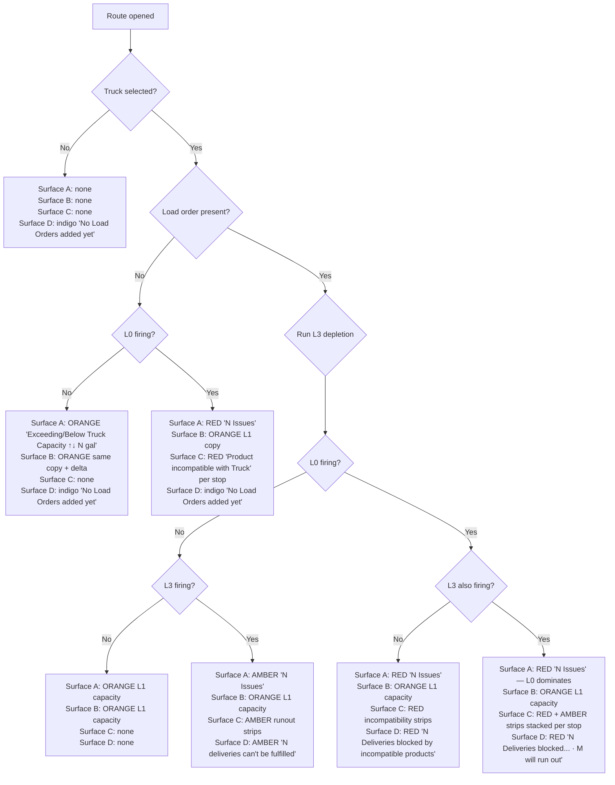

# Route Builder — Validation Framework

The validation system evaluates route health across 4 severity levels and surfaces messages at 4 distinct locations in the UI. The logic engine lives in `lib/capacity-validation.ts`. This document is the complete reference — copy strings, colors, decision rules, and co-occurrence behavior.

---

## The 4 Severity Levels

| Level | Name | What it checks | Requires |
|-------|------|---------------|----------|
| **L0** | Product incompatibility | Delivery order has a product the truck can't carry | Truck |
| **L1** | Capacity (total) | Route total demand vs truck total capacity | Truck |
| **L2** | Capacity (per product) | Per-product demand vs per-product truck capacity | Truck |
| **L3** | Stop-by-stop runout | Running balance goes negative at a delivery stop | Truck + Load order |

**Priority order when multiple levels fire simultaneously: L0 > L3 > L1/L2**

---

## The 4 UI Surfaces

| # | Surface | Trigger | Location in UI |
|---|---------|---------|---------------|
| **A** | Collapsed route card banner | Truck selected + any issue | Fixed footer of every route card (collapsed and expanded) |
| **B** | Below-truck message | Truck selected + L1 not "ok" | Under the truck picker row in the expanded route card |
| **C** | Order stop strip | L0 or L3 at a specific stop | Below the affected order card |
| **D** | Break CTA badge | Load exists + L0 or L3 fire | Between the last-good-stop and the first-failing-stop in the route timeline |

---

## Decision Tree



---

## Color Tokens

```
L0 (incompatible):   text #f87171   bg rgba(220,38,38,0.2)      — red
L3 (runout):         text #eab308   bg rgba(234,179,8,0.09)     — amber
L1/L2 (capacity):   text #fb923c   bg rgba(251,146,60,0.1)     — orange
Connector dashed (L3 only):  repeating-linear-gradient #eab308 4px / 4px
Connector dashed (L0 present): repeating-linear-gradient #f87171 4px / 4px
Break ⊗ icon color:  matches connector color
```

---

## Surface A — Collapsed Route Card Banner

**Always rendered at the bottom of every route card (collapsed + expanded view)**

| Scenario | Color type | Banner text | Right side |
|----------|-----------|------------|------------|
| L0 only | RED | "N Issues" | "View" button → counter nav |
| L0 + L3 | RED | "N Issues" | "View" button → counter nav |
| L3 only | AMBER | "N Issues" | "View" button → counter nav (2+ stops) / StopChip (1 stop) |
| L1 exceeding, no loads | ORANGE | "Exceeding Truck Capacity" | ↑ N gal |
| L1 below, no loads | ORANGE | "Below Truck Capacity" | ↓ N gal |
| L1 exceeding, load present, L3 clear | ORANGE | "Exceeding Truck Capacity" | ↑ N gal |
| L1 below, load present, L3 clear | ORANGE | "Below Truck Capacity" | ↓ N gal |
| All clear (loads cover, no issues) | none | — | — |

**Counter navigation (View → 1/N chevrons):** appears on the banner right side when 2+ unique stops have issues. "View" on initial expand → jumps to first issue. Chevrons ↑↓ cycle through stops. Collapsing the card resets to "View."

---

## Surface B — Below-Truck Dropdown Message

**Always shows the L1 capacity state. Never shows L0 or L3 — those are on Surfaces C and D.**

| Scenario | Text | Arrow | Delta |
|----------|------|-------|-------|
| L1 exceeding (any load state) | "Exceeding Truck Capacity" | ↑ | N gal |
| L1 below (any load state) | "Below Truck Capacity" | ↓ | N gal |
| L1 ok | — | — | — |

- Color always: `#fb923c` (orange)
- Left indent: 36px
- Delta computed from `l1.diff` directly — persists even when L3 or L0 is also firing
- "View Truck Details" ghost button always shown when truck is selected (below this message)

---

## Surface C — Order Stop Strip

**Rendered below each affected order card. L0 and L3 can stack at the same stop.**

### Single issue

| Issue | Background | Text color | Icon | Copy |
|-------|-----------|-----------|------|------|
| L0 | `#1b1b1b` | `#f87171` | TriangleAlert | "[Product] is incompatible with Truck" |
| L3 first-failing | `#1b1b1b` | `#eab308` | TriangleAlert | "[Product] will run out before this stop" |
| L3 downstream | `#1b1b1b` | `#eab308` | TriangleAlert | "[Product] already ran out" |

### Multiple products at the same stop (same issue type)

| Count | Format |
|-------|--------|
| 1 product | "Gas 87 will run out before this stop" |
| 2 products | "Clear and Gas 87 will run out before this stop" |
| 3+ products | "Clear and Gas 87 + N more will run out before this stop" |

**Max 2 lines total in the warning area.** If both L0 and L3 fire at the same stop, each gets its own strip — but total product names across both strips is capped using the "+ N more" truncation when the combined text would exceed 2 lines.

### L0 + L3 co-occurring at the SAME stop

Two strips stacked, no gap between them:
- **Top strip:** RED — L0 incompatibility message
- **Bottom strip:** AMBER — L3 runout message
- Both share `#1b1b1b` background. The card has rounded top corners; the bottom strip has rounded bottom corners (`border-radius: 0 0 4px 4px`). No red border on the card itself — strip-only treatment.

*(Figma reference: node 1628-46308, file Zvutylr6lxkxIuKMXEuSX6)*

---

## Surface D — Break CTA Badge

**Appears in the route timeline between the last-good-stop and the first-failing-stop. Only shown when a load order exists.**

### Structure
```
[Seq col: ⊗ icon]  [dashed arm]  [Badge — full card width, centered text]
                                  [Indigo CTA row: "Add another load order" | "+ Add Load Order"]
```

- ⊗ = XCircle icon, color matches connector
- Dashed arm = horizontal dashed line from ⊗ to badge
- Connector line (vertical) = dashed, runs through all failing stops below the break

### Badge copy variants

| State | Badge color | Text |
|-------|------------|------|
| L3 only | AMBER `rgba(234,179,8,0.09)` | "N deliveries can't be fulfilled" |
| L0 only | RED `rgba(220,38,38,0.2)` | "N Deliveries blocked by incompatible products" |
| L0 + L3 | RED `rgba(220,38,38,0.2)` | "N Deliveries blocked by incompatible products · M will run out" |

- N = count of unique failing delivery stops
- M = count of stops with L3 runout issues
- Text is centered, no icon in the badge
- Connector line and ⊗ icon: AMBER when L3 only; RED when L0 is present

### Indigo CTA row (always same regardless of L0/L3)
- Background: `rgba(99,102,241,0.1)`
- Left text: TriangleAlert icon + "Add another load order" — color `#818CF8`
- Right button: "+ Add Load Order" — standard ghost button

---

## Multi-Product Truncation Rule

Applies everywhere product names appear in Surface C strips and Surface D badge copy.

```
1 product  → "[Product A]"
2 products → "[Product A] and [Product B]"
3 products → "[Product A] and [Product B] + 1 more"
4 products → "[Product A] and [Product B] + 2 more"
```

**Hard limit: max 2 lines of text in the stop warning area.** This applies across both stacked strips (L0 + L3). If a single strip would wrap to 3 lines, truncate product list.

---

## Connector Line Rules

The vertical dashed line in the sequence column:

| State | Color | Style |
|-------|-------|-------|
| Before break point | `#282828` | Solid 1px |
| L3 only — after ⊗ | `#eab308` | Dashed (4px on / 4px off) |
| L0 present — after ⊗ | `#f87171` | Dashed (4px on / 4px off) |

The connector turns at the ⊗ icon and continues dashed through all stops after the break, including the end hub.

---

## No Load Orders State

When a truck is selected but **no load order exists**:
- Surface A: ORANGE banner (L1 capacity only)
- Surface B: ORANGE L1 message
- Surface D: indigo "No Load Orders added yet" + "+ Add Load Order" button (not the break CTA)
- Surface C: nothing (L3 requires loads to run)
- L0 CAN still fire (doesn't need loads) — if it does, Surface A goes RED, stop strips show red

---

## L0 Trigger Condition

L0 fires whenever a **delivery order** contains a product that the assigned truck's compartments cannot carry. Checked at the truck level — no load order required. Can co-occur with L3 at any time once a load is also present.
